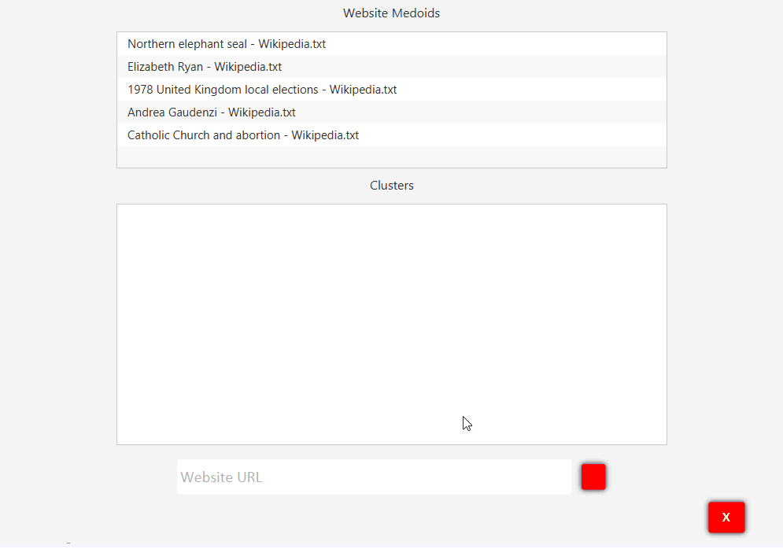

# Custom-Wiki-BTree

This repository contains two programs, the loader and the application. The loader reads 5 Wiki sites from a text filea and crawls to 19 more from each. A BTree was implemented from the Intro to Algorithms: Chapter 19 to collect wrods from each Wiki site and their frequencies. Once the BTree for each site is created, it's cached and stored persistently. Medoids are created by swapping from our original 5 root Wiki pages 1000 times and also stored persistently. The application part of the project reads all the BTrees into main memory (100 isn't actually that many), and allows the user to select a medoid, see what the associated websites (these were computed in the loader program) and enter a Wiki page of their choice to see which cluster it belongs to.

